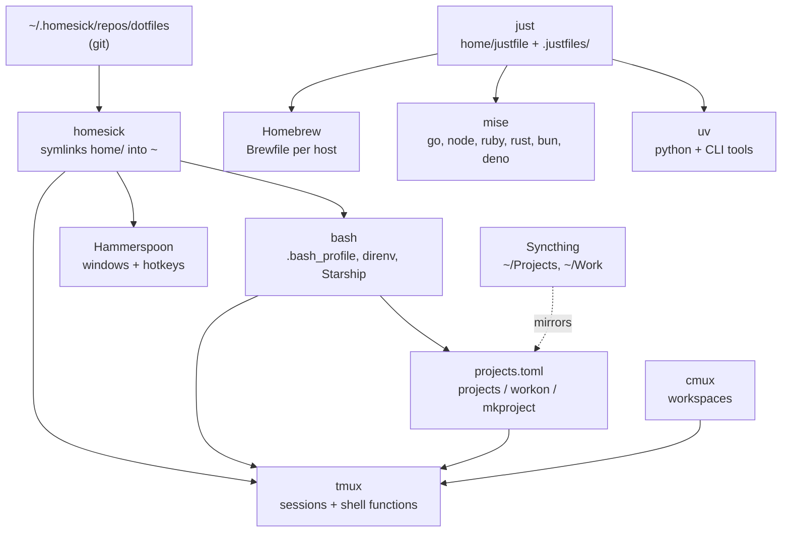

# How the pieces fit together

The dotfiles are one git repository, checked out at `~/.homesick/repos/dotfiles`
on three Macs. Everything under `home/` is linked into `~`. A small set of
tools then divides the work between them. This page says which tool owns what,
so you know where to look when something needs to change.

## The three Macs

| Key | ssh name | Role |
| --- | -------- | ---- |
| `studio` | `mac-studio-2023` | Desktop, most long-running tmux sessions |
| `mini` | `mac-mini-pro-2023` | Desktop, second set of sessions |
| `air` | `mba-2025` | Laptop; reports `MacBook-Air-2025` as its own hostname |

The short keys and ssh names live in the `[machines]` table of the
[project registry](machines.md). Every script that reaches another Mac reads
that table, so a machine is added once and known everywhere.

`~/Projects` and `~/Work` are Syncthing folders. The same directories exist on
all three Macs, which is why a directory's presence proves nothing about where
you work on it. The registry records that instead.

## Who owns what

| Concern | Owner | Where it is configured |
| ------- | ----- | ---------------------- |
| Getting files into `~` | [homesick](https://github.com/technicalpickles/homesick) | `homeslice.toml` lists the links; `.homesick_subdir` names folders whose children are linked one by one |
| Packages and apps | Homebrew | `home/Brewfile.cog` is the template; `home/Brewfile.<Host>` is what each Mac actually has |
| Tasks you run by hand | [just](https://github.com/casey/just) | `home/justfile` plus one module per topic in `home/.justfiles/` |
| Language runtimes | [mise](https://mise.jdx.dev/) | `home/.config/mise/config.toml`; Python is disabled there on purpose |
| Python interpreters and CLI tools | [uv](https://docs.astral.sh/uv/) | `home/.justfiles/python.justfile`; `uv python install --default` owns `python` on the PATH |
| Per-directory environment | [direnv](https://direnv.net/) | `home/.config/direnv/direnvrc` defines `layout uv` and `use tmux` |
| Prompt | [Starship](https://starship.rs/) | `home/.config/starship.toml` |
| Terminal sessions | tmux | `home/.tmux.conf`; functions in `home/.bashrc.d/20-tmux.bash` |
| Terminal windows | [cmux](https://github.com/manaflow-ai/cmux) | `home/bin/cmux-*` keep workspaces and sessions in step |
| Where projects live | the project registry | `~/Projects/projects.toml`, edited by `projects`; opened by `workon` and `mkproject` in `home/.bashrc.d/60-workon.bash` |
| Windows and app hotkeys | [Hammerspoon](https://www.hammerspoon.org/) | `home/.hammerspoon/` |
| Lint | prek | `.pre-commit-config.yaml`, run by `just lint` and by CI |
| This manual | Zensical | `zensical.toml` and `docs/`, published by the Docs workflow |

## How a shell starts

1. `~/.bash_profile` sources every `~/.bashrc.d/*.bash` file in name order: exports, tmux, aliases, functions, secrets, the OS file, then workon.
2. `50-osx.bash` and `50-linux.bash` each start with a `uname` check and return on the other OS.
3. `60-workon.bash` defines `workon` and `mkproject`.
4. `~/.bashrc` sources `20-tmux.bash`, starts Starship, and installs the direnv hook.
5. If `TMUX_AUTOATTACH` is set, `20-tmux.bash` attaches the named session. A project's `.envrc` sets that variable through `use tmux`.

To add shell config, drop a numbered `.bash` file into `home/.bashrc.d/`. Nothing else needs editing.

The result: `cd` into a project, direnv activates its venv and, when the
project asked for it, drops you into its tmux session.

## How a project is opened

`workon <name>` asks `projects resolve` where the project lives. The answer is
one of three things:

| Answer | What happens |
| ------ | ------------ |
| No machine recorded | `cd` and activate here; the directory is on every Mac |
| This machine | `cd` and activate here |
| Another machine | `mosh` to it, and attach its tmux session when the entry says `tmux = true` |

A project not in the registry falls back to a scan of `~/Projects`, `~/Work`,
and `~/.virtualenvs`, so the old behaviour still works. The full decision tree
is in [How workon resolves a project](workon-process.md).

## How the Macs see each other

Names resolve over Tailscale MagicDNS or `~/.ssh/config`. Remote commands use
one-shot, non-interactive ssh with `BatchMode=yes`, so a host that would prompt
fails fast instead of hanging. `tmux-remote-ls` and `workon --sessions` probe
every Mac at once and skip the one you are sitting at. cmux can answer the
same question through its own rpc, and the scripts try that first.

## What is deliberately not here

- No `gh-pages` branch. The manual deploys from a workflow artifact.
- No pyenv. uv provides every Python. The old `~/.pyenv` directories are
  leftovers, see [Maintenance](maintenance.md).
- No virtualenvwrapper. `~/.virtualenvs` still exists as an archive of old
  environments, and `workon` still looks there as a last resort.
- No Sublime Text settings. The editor keeps its own.
